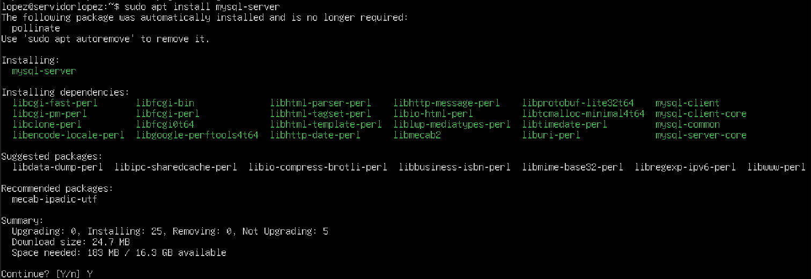
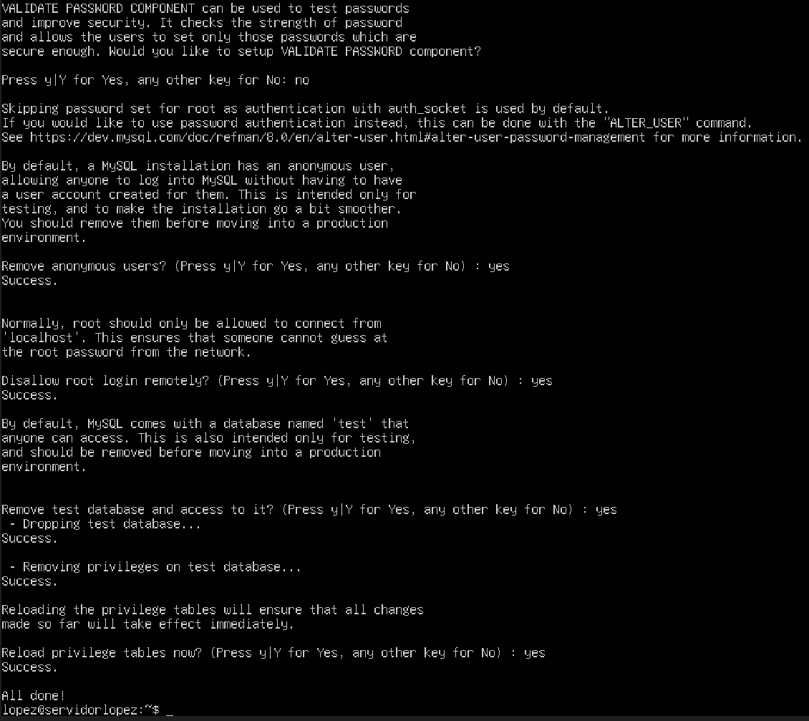
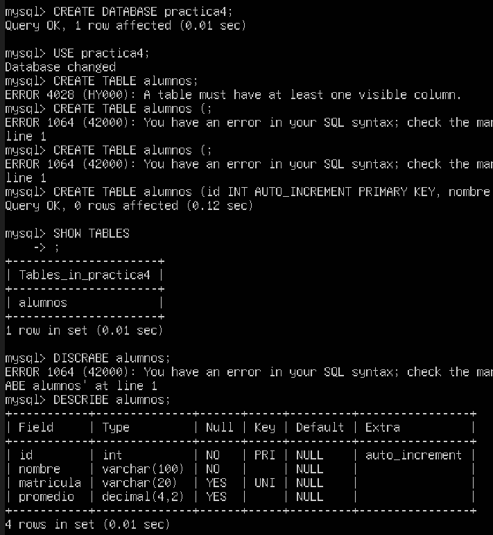
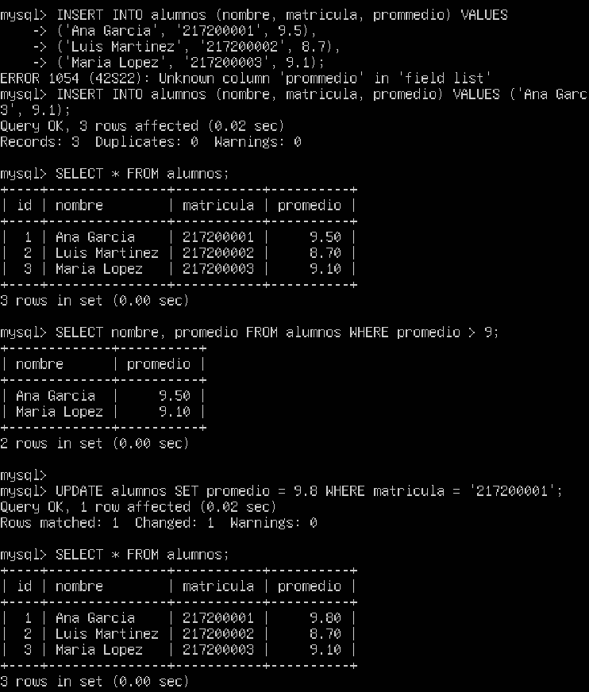

# Instalación, Configuración y Aseguramiento de MySQL 8.0 en Ubuntu Server

## Creador
* Sandoval López Daniela


## Especificaciones Técnicas
* **Sistema Operativo Base:** Ubuntu Server 24.04 LTS / 26.04 LTS en entorno virtualizado (VirtualBox 7.2.16)[cite: 13, 15]
* **Motor de Base de Datos:** MySQL Server 8.0 / 8.4[cite: 13, 17]
* **Gestor de Paquetes y Servicios:** APT (`apt install mysql-server`) y `systemctl`[cite: 13, 15, 16]
* **Herramientas de Seguridad y CLI:** Script de hardening `mysql_secure_installation` y cliente interactivo `mysql` CLI[cite: 14, 16, 17]
* **Mecanismos de Autenticación:** Unix Socket (`auth_socket`) para usuario `root` y Principio de Menor Privilegio[cite: 14, 16, 19]
* **Lenguaje de Consultas:** SQL Estándar (Sentencias DDL: `CREATE DATABASE`, `CREATE TABLE`; Sentencias DML: `INSERT`, `SELECT`, `UPDATE`)[cite: 14, 17, 18]
* **Estructura:** Reporte de Laboratorio y Scripts de Configuración (`Servidores II`)[cite: 12, 13]

---

## Descripción del Proyecto
Este proyecto aborda la instalación, endurecimiento (*hardening*) y administración fundamental del sistema gestor de bases de datos relacional (SGBDR) MySQL 8.0 sobre un servidor Linux Ubuntu Server, estableciendo una infraestructura de base de datos segura y funcional.

El desarrollo abarca los siguientes componentes clave:

1. **Despliegue y Endurecimiento (*Hardening*) del Servidor:**
   * **Instalación y Gestión del Servicio:** Despliegue de `mysql-server` desde los repositorios oficiales mediante APT y verificación del estado operativo mediante `systemctl status mysql`[cite: 13, 15, 16].
   * **Script de Seguridad:** Ejecución de `mysql_secure_installation` para mitigar vulnerabilidades críticas: eliminación de usuarios anónimos, deshabilitación del acceso remoto al usuario `root` y supresión de la base de datos de prueba (`test`)[cite: 14, 16, 20].
   * **Autenticación por Socket Unix:** Configuración de la autenticación por socket para `root`, garantizando que el acceso administrativo requiera privilegios del sistema operativo mediante `sudo`[cite: 14, 16, 19].

2. **Modelado y Operaciones SQL Básicas (DDL y DML):**
   * **Estructuración de Datos (DDL):** Creación de la base de datos `practica4` y la tabla `alumnos`, implementando tipos de datos relacionales (`INT`, `VARCHAR`, `DECIMAL`), restricciones de unicidad (`UNIQUE`) y el atributo `AUTO_INCREMENT` para claves primarias[cite: 17, 19].
   * **Manipulación e Integridad de Datos (DML):** Ejecución de sentencias SQL para la inserción masiva de registros (`INSERT INTO`), consultas filtradas con cláusulas condicionales (`SELECT ... WHERE`), actualización de información (`UPDATE`) y comprobación de persistencia[cite: 14, 18, 20].

---


## Imágenes

**Instalación de MySQL Server con APT**


**Configuración de seguridad con `mysql_secure_installation`**


**Estructura de la base de datos (CREATE TABLE / DESCRIBE)**


**Consultas DML (INSERT / SELECT / UPDATE)**


---

## Instrucciones de Ejecución

1. Iniciar la máquina virtual con **Ubuntu Server** en **VirtualBox** e ingresar a la terminal del sistema con un usuario que posea privilegios `sudo`[cite: 13, 15].
2. Actualizar el índice de paquetes e instalar el motor MySQL ejecutando[cite: 13, 15]:
   ```bash
   sudo apt update && sudo apt install mysql-server
